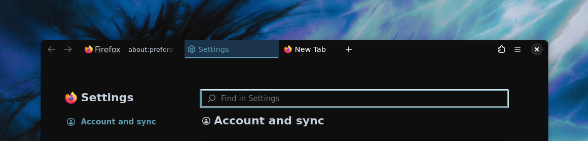

# FoxOne

Kyle's fork: a dark blue and teal palette, shorter URL bar, and clearer selected tabs. Based on [Firnschnee/FoxOne](https://github.com/Firnschnee/FoxOne).

> Tested with Firefox 157 on Windows, macOS, and Linux (GNOME & KDE) with `browser.nova.enabled` set to `true`



- Shared desktop colors: near-black backgrounds, muted blue highlights, and teal accents.
- Shorter URL bar, with translate, pop-out video, bookmark, and search-selector buttons hidden.
- Selected tabs have a blue background and teal underline; the pinned-tab glow is removed.
- Below 700px, tabs and the URL bar use separate rows, with more room for pinned tabs.

See [local setup and upstream update notes](LOCAL.md).

### Firefox settings

Set these values in `about:config` (or add them to your profile's `user.js`):

```js
user_pref("toolkit.legacyUserProfileCustomizations.stylesheets", true);
user_pref("browser.nova.enabled", true);
user_pref("svg.context-properties.content.enabled", true);
user_pref("browser.uidensity", 1);
user_pref("browser.compactmode.show", true);
user_pref("browser.tabs.inTitlebar", 1);
user_pref("browser.theme.content-theme", 0);
user_pref("browser.theme.toolbar-theme", 0);
user_pref("layout.css.prefers-color-scheme.content-override", 0);
user_pref("browser.toolbars.bookmarks.visibility", "never");
```

These match the preview: compact density, dark browser and content colors, tabs in the title bar, and no bookmarks toolbar. Copy both CSS files into your profile's `chrome` directory, then restart Firefox. For the same new-tab appearance, turn off widgets in Firefox's new-tab settings.

**[Install](https://firnschnee.github.io/FoxOne/installation.html)** | **[Customise](https://firnschnee.github.io/FoxOne/customisation.html)** | **[See it in action](https://firnschnee.github.io/FoxOne/action.html)**

Over 40 variables for colors, layout and toggles. Missing something or found a bug? Open an [Issue](https://github.com/Firnschnee/FoxOne/issues) or a PR.

_I use Firefox ESR, which release should I use?_
> - **ESR 153** (with `browser.nova.enabled`) – use [**3.5.2**](https://github.com/Firnschnee/FoxOne/releases#release-3.5.2)
> - **ESR 140** (with the classic **pre-Nova** UI) – use [**2.3**](https://github.com/Firnschnee/FoxOne/releases/tag/2.3)

Using Thunderbird? Take a look at [BirdOne](https://github.com/Firnschnee/BirdOne).

Special shoutout to [@NeroWolfe75](https://github.com/NeroWolfe75) for all the bug hunting & ideas!

---
Inspired by [Cascade](https://github.com/andreasgrafen/cascade) & [LittleFox](https://github.com/biglavis/LittleFox) | It works with [Adaptive Tab Bar Colour](https://addons.mozilla.org/de/firefox/addon/adaptive-tab-bar-colour/) | License: [MIT](LICENSE)
